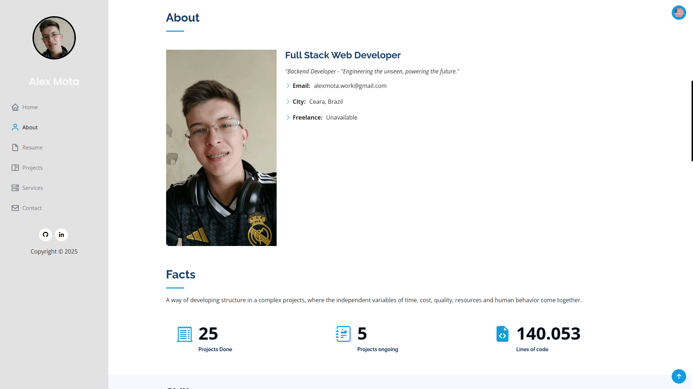

# README DO PROJETO

## Bom dia rede espero que estejam bem, eu queria compartilhar o meu portfolio com alguns dos projetos que já fiz, usei apenas JS, CSS e HTML para a construção da pagina, além de ter adicionado resposividade ao site que possibilita que qualquer veja a pagina através de um dispositivo móvel. como ainda não postei todos os meus projetos no portfolio, nos próximos dias pretendo adicionar mais alguns

### Sintam-se a vontade para dar sugestões de melhoria ou reportar bugs 🐛

- Abaixo uma previa do site:

- [Visite meu portfolio](https://alexmota-dev.github.io)

